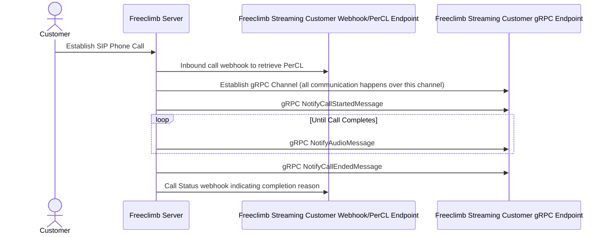
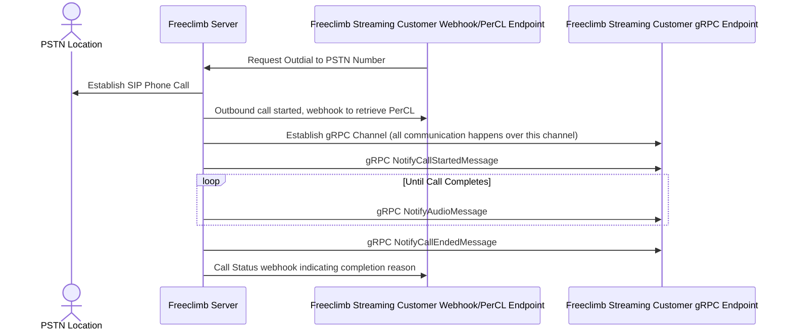

# Getting Started

AudioStream enables users of the FreeClimb platform to interact with phone calls via streaming, instead of callback based PerCL.
This enables new and innovative functionality similar to having a SIP endpoint but without requiring the complexity.
The AudioStream command sets up a gRPC channel to the client application, this runs over HTTP2. Since gRPC runs over HTTP2 this can be proxied like regular HTTP2 traffic. This channel is persistent per call and cannot be transferred at this time.
gRPC uses Protocol Buffers to standardize the message shape and structure over the wire, but it also enables users to automatically generate preliminary client/server implementations.

## Requirements

- FreeClimb account, number, and application
- gRPC server capable of handling [bidirectional streaming](https://grpc.io/docs/what-is-grpc/core-concepts/#bidirectional-streaming-rpc)
- Webserver to return PerCL to configure Audio Streaming

## PerCL, gRPC, and Webhooks

FreeClimb has a variety of ways to communicate with applications both to receive commands as well as simply notify the user application of a certain event.
Webhooks are used to notify the application that an event has taken place. They only occur outside of the context of the Audio Stream, as the Audio Stream handles all of the audio and other events that would conventionally be handled by PerCL and webhooks in a FreeClimb application.
In order to handle both webhooks and gRPC traffic, 2 seperate applications would be used (though they can be combined), one to handle the HTTP webhooks and one to handle the gRPC channels.

### Inbound Call

### Outbound Call

To start the flow we will trigger an outdial to a PSTN location via the [Call Creation API](https://docs.freeclimb.com/reference/make-a-call) which will allow us to instantiate a call and then utilize PerCL to manage it.
Once the call is established, a webhook to the specified `callConnectUrl` will fire and we can assume control of the call utilizing the AudioStream command.

