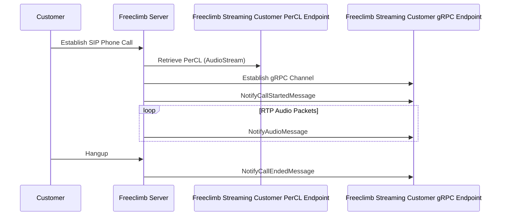
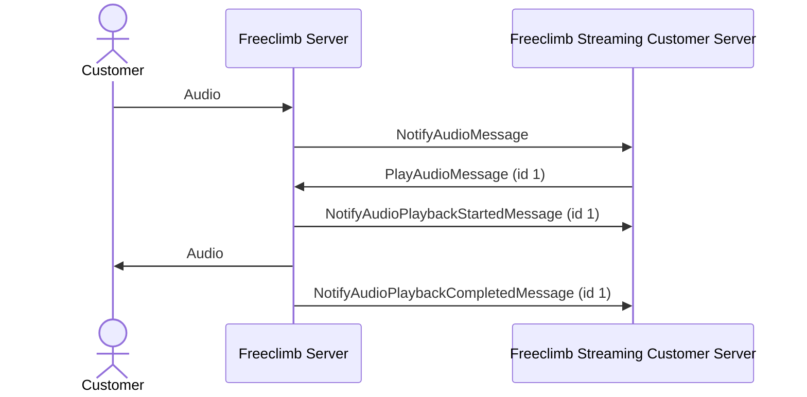
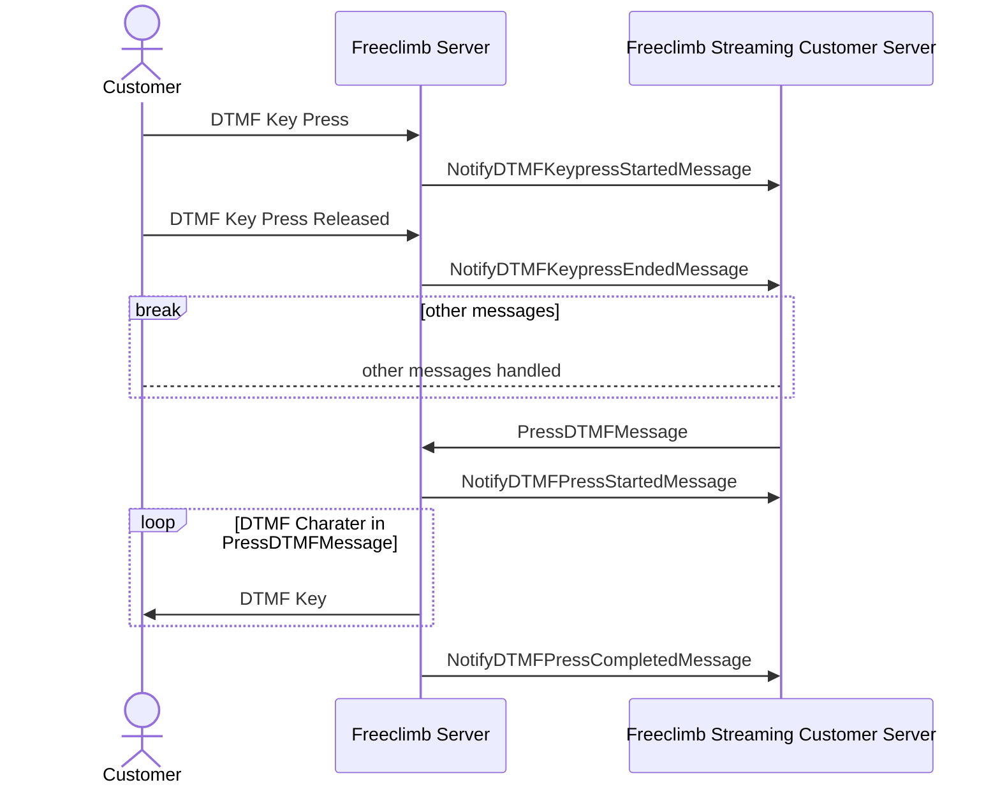
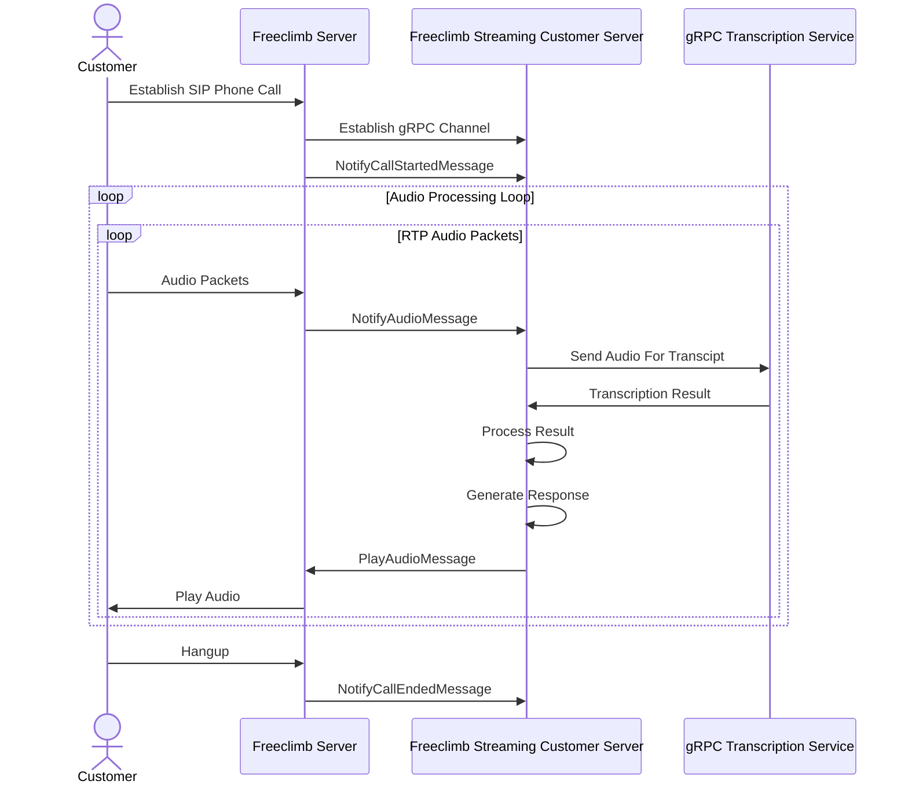

# gRPC Server

## Bidirectional Streaming

In order to receive and play audio simultaneously a bi-directional streaming architecture is used.
The server is expected to handle any of the possible messages from FreeClimb, the complete list can be see in the [specification](../proto/ivr.proto) or in the [documentation](./4-protobuf-messages.md).
There is no requirement for the server to ever send a message back, however this would mean no audio would be played to the customer.
FreeClimb will always send a `NotifyCallStartedMessage` first, followed by `NotifyAudioMessage` throughout the duration of the call, followed by a `NotifyCallEndedMessage` with some description of why the call ended.

At any time during the call, the server can send any of the following `Application` messages.

## Message Types

| Message Name | Description | Sender |
| ------------ | ----------- | ------ |
|`NotifyCallStartedMessage` | the first message sent once the connection is established, it will contain the metadata set in the initial PerCL command as well as other data about the call| FreeClimb |
|`NotifyAudioMessage` | sent once per RTP packet received, approximately every ~20ms, contains the raw audio| FreeClimb |
|`NotifyDTMFReceivedStartedMessage` | sent when a DTMF press has started| FreeClimb |
|`NotifyDTMFReceivedEndedMessage` | sent when a DTMF press has completed| FreeClimb |
|`NotifyAudioPlaybackStartedMessage` | indicates that audio sent by the application has started to play| FreeClimb |
|`NotifyAudioPlaybackCompletedMessage` | indicates that the segment of audio sent by the application has completed| FreeClimb |
|`NotifyAudioBufferClearedMessage` | indicates that the buffer has been successfully cleared| FreeClimb |
|`NotifyDTMFPlayStartedMessage` | indicates that the DTMF playback has started| FreeClimb |
|`NotifyDTMFPlayCompletedMessage` | indicates that the DTMF playback has completed| FreeClimb |
|`NotifyCallEndedMessage` | sent at the end of the call, indicates the call is over and some data regarding how the call ended| FreeClimb |
|`NotifyErrorMessage` | general purpose message used to indicate that some error has occurred, will be seen if audio buffer is overfilled or content types are incorrect.| FreeClimb |
|`NotifyBufferDepthMessage` | response to request regarding buffer depth| FreeClimb |
|`PlayAudioMessage` | raw audio to play to the caller| Application |
|`ClearAudioBufferMessage` | clear the audio buffer in FreeClimb to enable new audio to be played| Application |
|`PressDTMFMessage` | send a DTMF character or characters to caller| Application |
|`TerminateCallMessage` | hangup call| Application |
|`EndGrpcStreamMessage` | return control to standard PerCL/API handling (unimplemented)| Application |
|`QueryBufferDepthMessage` | ask FreeClimb how many entries are in DTMF/Audio buffers| Application |

## Sample Flows

## Notes

These diagrams show the user hanging up the phone. However during the course of a call the application can provide a TerminateCallMessage. This will be percevied by the FreeClimb as if the gRPC channel hung up the call, propagating the hang up to the customer, and sending a webhook indicating the call is over. In addition DTMF could be used via `*8` to transfer the call, which would appear from the gRPC perspective to be a regulat user hangup.

## Diagrams

### Audio

### DTMF

### Example Architecture with Transcription

