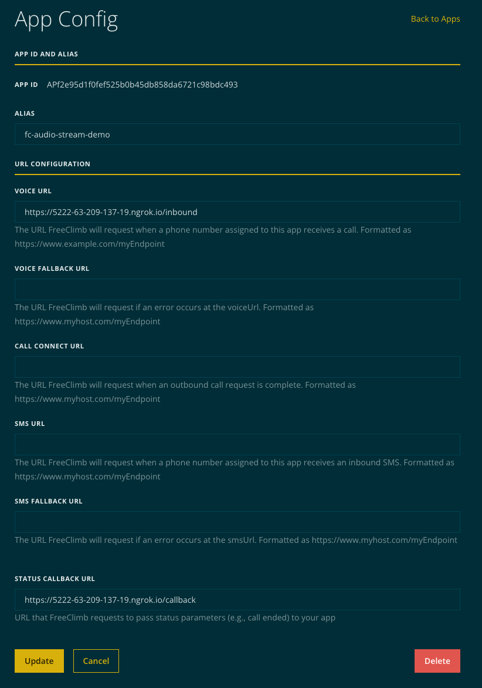
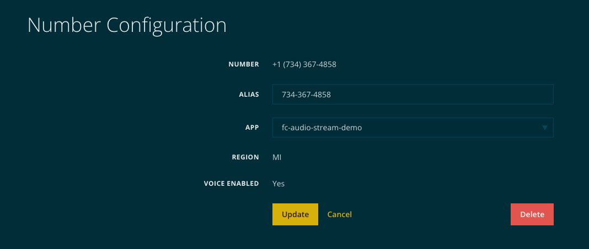

# Demo Application(s)

## Steps

1. Determine how to expose application
    a. [ngrok](#ngrok) - allows local development but can be limited by firewalls and requires a ngrok account to proxy TCP traffic
    b. [directly](#direct-access) - requires a server and public IP space (or proxy that can handle gRPC/HTTP2)

2. Run gRPC server component to be exposed

    ```bash
    git clone https://github.com/freeclimbapi/freeclimb-protobuf-specification
    cd freeclimb-protobuf-specification/examples/python/server
    ./setup.sh
    ```

3. Configure PerCL server to serve AudioStream PerCL command pointing at gRPC component

    ```bash
    cd freeclimb-protobuf-specification/examples/python/server
    source venv/bin/activate
    WEBHOOK_HOST=<url for this webserver> AUDIO_STREAM_HOST=<host and port of grpc server> python3 webserver.py
    ```

4. Configure FreeClimb application to point at PerCL server
    
5. Purchase and associate number with FreeClimb application
    

## ngrok

1. Configure ngrok with multiple tunnels

    ```bash
    ngrok config edit

    # add these lines
    tunnels:
        grpc:
            proto: tcp
            addr: 50051
        http:
            proto: http
            addr: 5001

    # start the ngrok tunnel
    ngrok start http grpc

    # from the output you will need both tunnels to add to the WEBHOOK_HOST and AUDIO_STREAM_HOST above
    ```

## Direct Access

Depends heavily on the environment the applications are being deployed in. This typically will require public IP space, or a proxy that handles HTTP2 traffic, this includes many common open source proxies.
