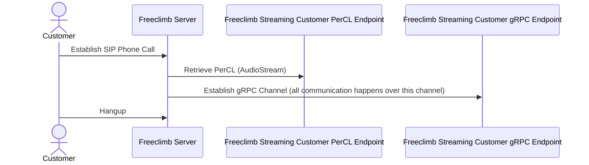

# FreeClimb Audio Streaming

## Summary

Audio Streaming is a mechanism to enable a direct connection from the FreeClimb platform to an application which will be responsible for directly processing and responding with audio packets. This differs significantly from the existing methods of interfacing with FreeClimb Calls, rather than sending PerCL commands or API requests you directly interact with streaming audio. This enables high performance applications that can perform real time transcription, speech synthesis, and other innovative solutions.

The gRPC stream uses [Protobufs](https://protobuf.dev/overview/) to communicate across the gRPC channel. The specification for the gRPC service and Protobuf messages is available [here](./proto/ivr.proto). This defines the bidirectional gRPC service used for communication between FreeClimb and the application.

## Audio Streaming Structure

## Detailed Documentation

[Caveats (PLEASE READ)](docs/0-caveats.md)

[Getting Started](docs/1-getting-started.md)

[PerCL](docs/2-percl.md)

[gRPC Server](docs/3-grpc-server.md)

[Demo Application](docs/4-demo-applications.md)
